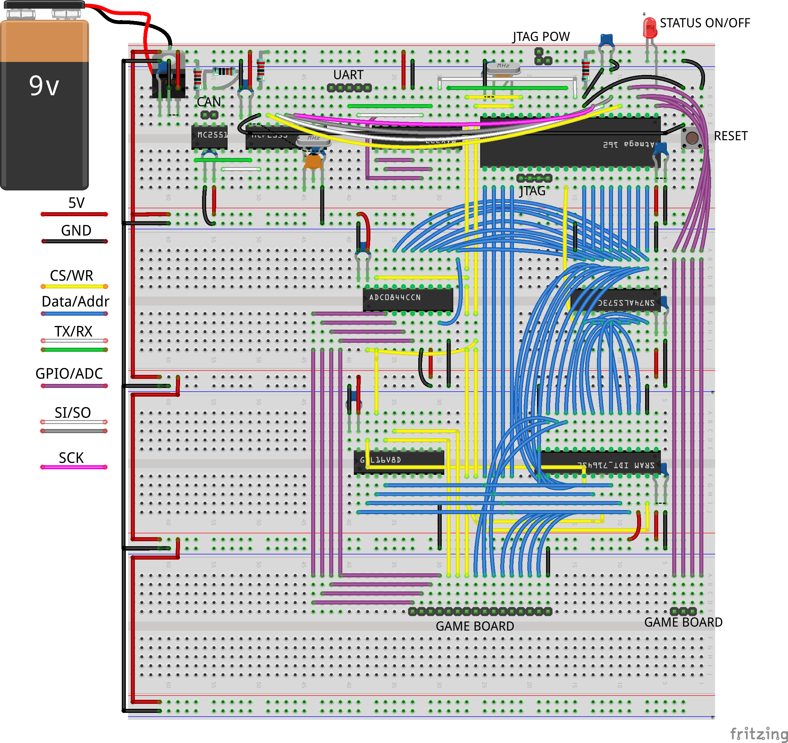
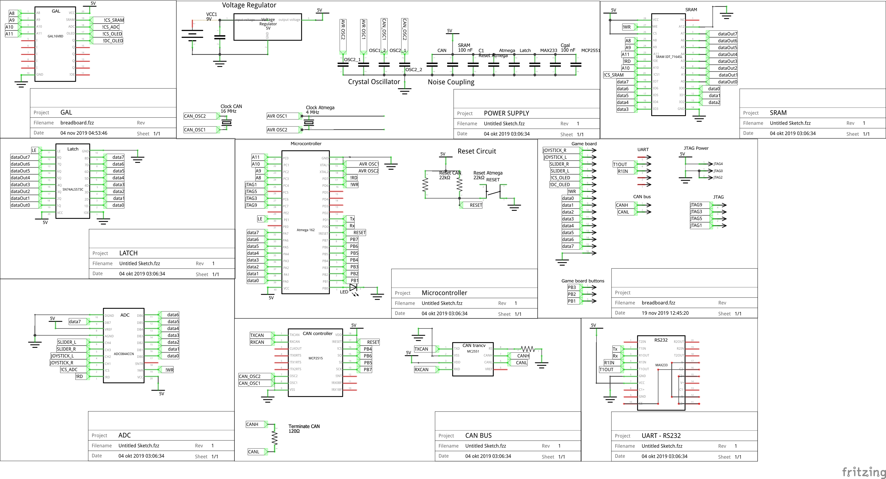
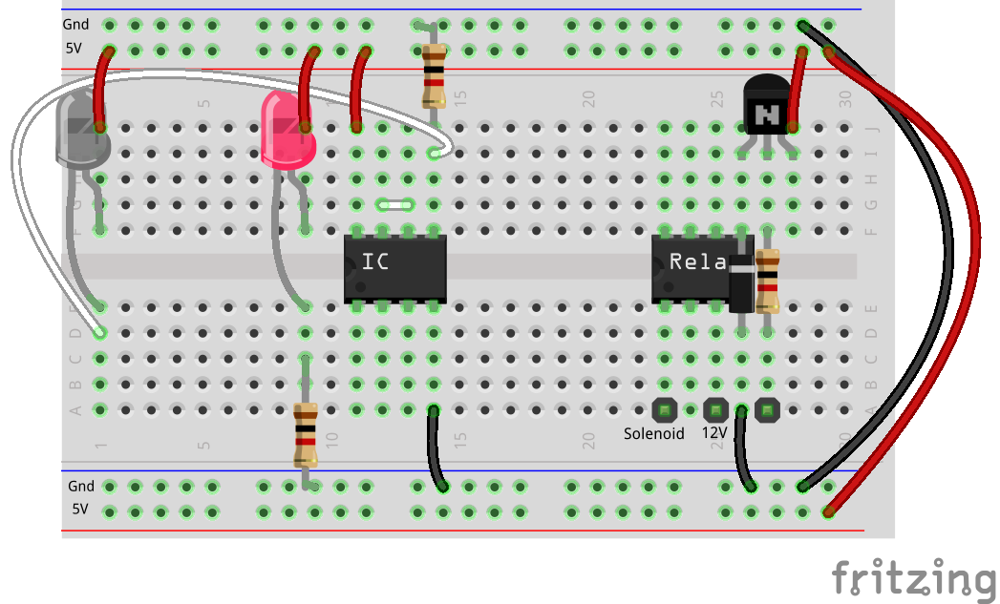
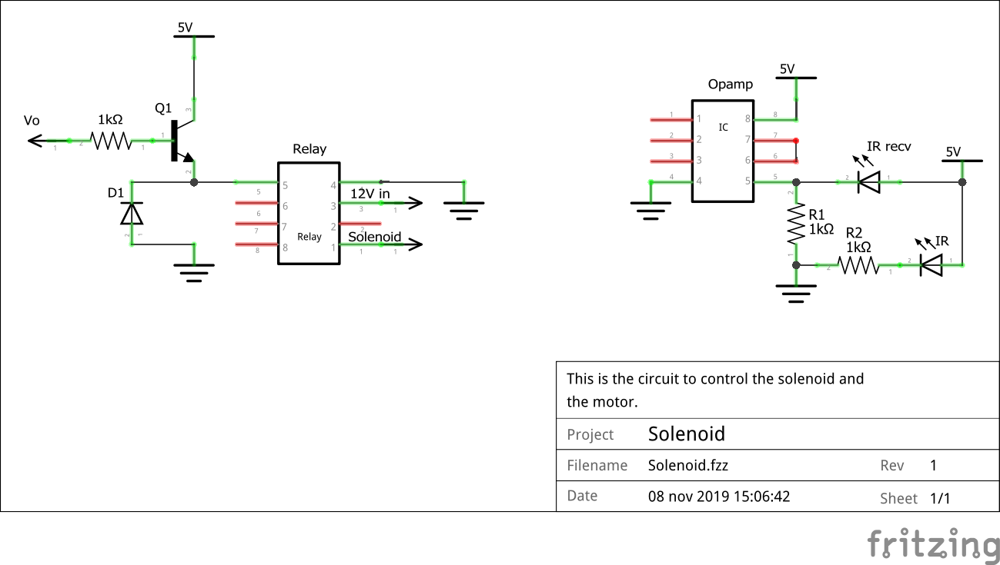

# Ping-pong game
 This is the term project for Embedded and Industrial Computer Systems Design at NTNU fall 2019. The goal has been to make a "ping-pong" game to shoot a ping-pong ball with a solenoid and control a servo and motor so this solenoid can move.
 
 ## Main breadboard

 

### Connections
 

### Schematic
 

## Solenoid and IR-diode
 

### Schematic

